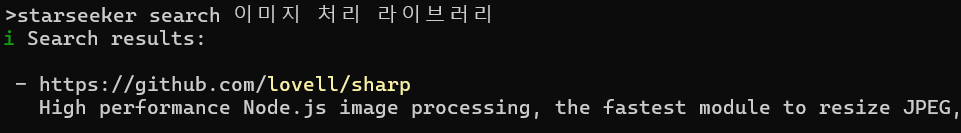

# ⭐ Starseeker

StarSeeker is a CLI tool to search your starred GitHub repositories using natural language.



## Features

- Index your starred GitHub repositories via the GitHub API
- Natural language repository search powered by Ollama
- Configuration management (GitHub PAT, Ollama settings, embedding models, etc.)

## Installation

```bash
npm install -g starseeker
```

## Usage

### Configuration

Before using StarSeeker, you need to set up a few configurations:

#### Set GitHub Personal Access Token (Required)

```bash
# https://github.com/settings/personal-access-tokens
starseeker config set pat <your-github-pat>
```


#### Ollama Configuration (Optional)

```bash
# Set Ollama host
starseeker config set ollama host <ollama-host-url>

# Set Ollama API key (if required)
starseeker config set ollama key <ollama-api-key>
```

#### Embedding Model Configuration (Required)

```bash
starseeker config set embed model <embedding-model-name>
```

### View Current Configuration

```bash
# View GitHub PAT
starseeker config get pat

# View Ollama host
starseeker config get ollama host

# View Ollama API key
starseeker config get ollama key

# View embedding model
starseeker config get embed model
```

### Indexing Repositories

Index your starred GitHub repositories:

```bash
starseeker index
```

### Searching Repositories

Search your indexed repositories using natural language:

```bash
# Basic search (returns top 5 results by default)
starseeker search image processing library

# Specify number of results
starseeker search TypeScript ORM with PostgreSQL support --k 10
```

## Requirements

- GitHub Personal Access Token
- Access to Ollama and an embedding model

## License

MIT

## Contributing

Issues and pull requests are welcome.
